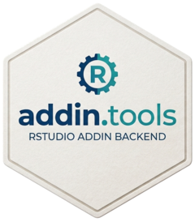

<!-- README.md is generated from README.Rmd. Please edit that file -->

<!-- badges: start -->

<!-- [](https://CRAN.R-project.org/package=addin.tools) -->

[](https://opensource.org/licenses/MIT)
[](https://github.com/GegznaV/addin.tools/actions)
[](https://github.com/GegznaV/addin.tools)
[](https://app.codecov.io/gh/GegznaV/addin.tools)
[](/commits/master)
<!-- badges: end -->

------------------------------------------------------------------------

# R package **addin.tools** <a href="https://gegznav.github.io/addin.tools/"></a>

Package `addin.tools` contains various functions that help to construct
*RStudio* addins. The functions are wrappers around package
`rstudioapi`. They are used as the core functions for packages
`addins.qmd`, `addins.rs` and other packages.

## Install package

<!-- Install released version from CRAN: -->

<!-- ```{r Install package from CRAN, eval=FALSE} -->

<!-- install.packages("addin.tools") -->

<!-- ``` -->

Install development version from GitHub:

``` r
if (!requireNamespace("remotes", quietly = TRUE)) install.packages("remotes")
remotes::install_github("GegznaV/addin.tools")
```

------------------------------------------------------------------------

More information at <https://gegznav.github.io/addin.tools/>

Package architecture and helper-family notes are documented in the
vignette [Package Architecture and Helper
Families](articles/helper-families.html).
